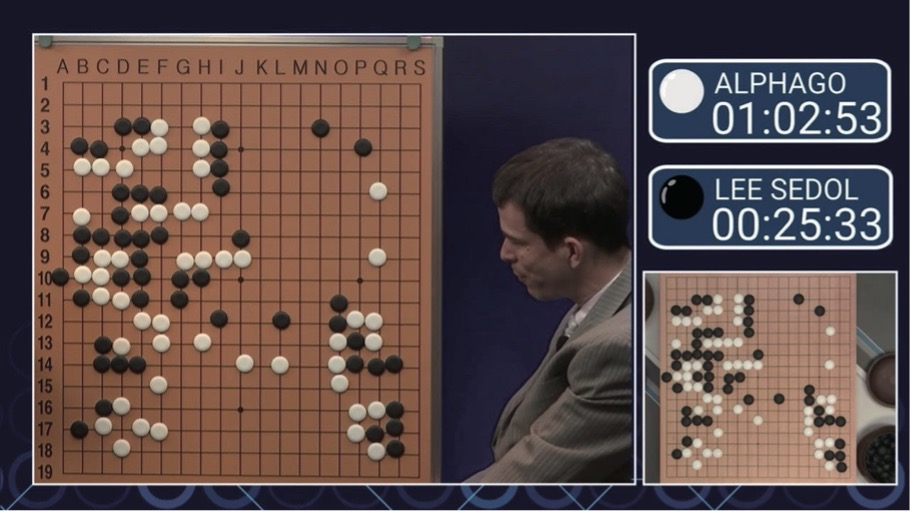

# 1.1. Domain Knowledge

일각에서는 유명한 SF영화처럼 인공지능과 로봇이 언젠가는 인간을 지배하는 세상이 올 것이라 상상하기도 한다. 본 가이드 제목의 ‘엔지니어를 위한’이라는 수식에 대한 의미를 설명하면서, 이 상상에 대해 의견을 보태어 보고자 한다.


세계를 떠들썩하게 했던 **Figure 1.**의 바둑 경기를 기억하는가? 구글 딥마인드\(DeepMind\)의 알파고\(AlphaGo\)는 몬테카를로 트리 알고리즘 기반 ‘탐색’, 최선의 수를 예측하는 ‘딥러닝’ 기법, ‘강화 학습’을 활용한 셀프 플레이로부터 얻은 경험이라는 엄청난 자원을 조합하여 바둑이라는 게임에서 인간 최고 뛰어넘어 충격을 안겨주었다.

이후 딥마인드의 거침없는 횡보는 계속되었다. 2017년 10월, 알파고의 후속작으로 강화 학습만을 이용한 ‘알파고 제로\(AlphaGo Zero\)’를 발표하였고, 알파고 제로는 알파고에 100대 0의 압승을 거두었다. 알파고 제로 이후 바둑 뿐 아니라 체스, 장기 등의 게임까지 정복해버린 범용 AI ‘알파 제로\(Alpha Zero\)’도 공개되었다. 이후 ‘스타크래프트\(Starcraft\) 2’를 마스터한 ‘알파 스타\(AlphaStar\)’, 게임 분야에 그치지 않고 단백질 입체 구조를 예측하는 ‘알파 폴드\(AlphaFold\)’등의 AI를 연이어 발표하였다. 딥마인드를 주축으로 AI산업은 거듭 한계를 뛰어넘고 있으며 그 강력함은 점점 상상을 초월하고 있다.

기술적 측면에서 보면, 머신 러닝은 데이터 기술을 활용하는 대표적인 소프트웨어 기술로 생각할 수 있다. 데이터 기술을 활용하는 여러 산업분야는 아주 오래 전부터 발전을 거듭해왔으며 축적된 노하우와 데이터의 가치는 시간이 지나도 변치 않는다. 실제로 머신 러닝, 딥러닝 분야도 최근 갑작스럽게 발전한 분야가 아니라 시간이 지나며 알고리즘, 컴퓨팅 파워\(하드웨어\)의 발전과 데이터의 축적이라는 머신 러닝의 주요 요소가 충족되어 최근 매우 다양한 형태로 빛을 발하기 시작하였다. 머신 러닝 알고리즘에 대해서는 이미 수많은 연구 개발에 의해 오픈 소스 형태로도 많이 공개되어있다. 컴퓨팅 파워 측면에서도 로컬 하드웨어의 성능 고민을 덜어주는 형태로 클라우드 서비스 등 진입 장벽이 충분히 낮아졌다. 결국 머신 러닝 경쟁력을 좌우하는 것은 데이터에 대한 문제이다. 구글·페이스북·아마존 같은 세계적 기업이 머신 러닝 분야에서 앞서나가는 것 역시 이들이 각각 검색과 SNS, 유통 분야에서 가장 많은 데이터를 확보하고 있기 때문이다. 데이터가 많으니 성능이 뛰어난 인공지능을 먼저 공개하게 되고, 사용자가 여기에 몰리며 데이터가 또 축적된다. ‘부익부 빈익빈’ 현상이다. 이처럼 데이터 기술은 그 중요성이 매우 크며 각 산업분야에서는 이미 데이터 기술을 활용하고, 적어도 데이터를 축적하고 있기 때문에 머신 러닝 산업은 훨씬 더 빨리 가속될 것이다.

하지만 그럼에도 불구하고 인공지능이 세상을 지배하게 될 것이라는 걱정은 말자. 그 이유를 몇가지 소개한다.

* 알파고는 과연 바둑의 복잡한 규칙을 모두 알고 있었을까? 그렇지 않다. 복잡한 신경망일수록 훈련 과정은 소위 ‘black box’와 같아진다. 이는 도메인 지식\(Domain knowledge\)의 부재이다. 인공지능이 아무리 발전하여도 각 산업분야의 도메인 지식까지 대체하긴 힘들다. \(현실적으로 모든 공학적 내용과 시스템 모델 등을 숫자로 표현할 수는 없기 때문이다.\) 또한 강화 학습의 보상 함수 설계 등 도메인 지식의 개입을 통해 성능 개선을 꾀할 수 있는 경우의 수가 매우 많다.
* 알파고를 훈련시키기 위해서는 바둑이라는 게임의 목표와 규칙을 컴퓨터의 언어로 변환을 해주어야 했다. 하지만 실제 우리가 살아가는 세상의 모든 문제가 꼭 바둑과 같이 수치적으로 표현될 수는 없다.
* 아직 ‘인지’ 적인 측면의 구현에 한계가 있으며, ‘인공지능이 예술 창작 등에 활용이 된다면 그 소유권에 대한 문제는 어떻게 할 것인가?’ 등 아직 인공지능에 대한 사회 제도와 윤리 규범에 대해서도 정립이 되지 않았다.

한편, 알파고는 이세돌 9단과의 대결 다섯 판을 통틀어 둔 517수 중 10여 수는 \(흔히 ‘떡수’라고 하는\) 형편없는 수를 두었다. 하지만 이 떡수 중 몇 수는 나중에 뒤돌아 봤을 때 굉장히 중요한 역할을 했던 ‘묘수’로 밝혀진 경우도 있었으며, 알파고 제로는 16만건의 기보 데이터의 도움 없이 스스로의 경험데이터로 알파고를 뛰어넘었다. 좋은 데이터에 의존하지 않은 것은 물론, 인간이 만들어 놓은 암묵적인 규칙과 공략법에 얽매이지 않은 결과물이라 할 수도 있다. 이는 인공지능이 인간에게 새로운 인사이트를 제공할 수 있는 가능성을 보여주는 예시이다.

이 주제에 대해 흥미가 있다면 마커드 드 사토이의 ‘창조력 코드’라는 책을 읽어보는 것을 추천한다.



#### 

#### Reference

Figure 1. : 알파제로를분석하며배우는인공지능

