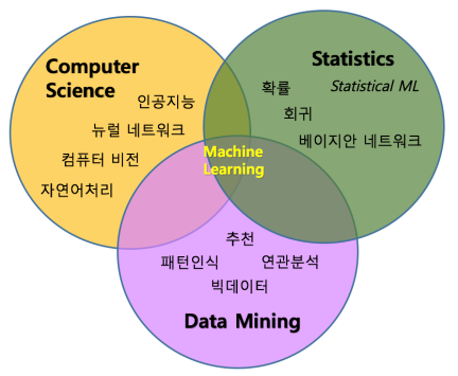

# 2.1. Difference between Traditional Statistics and ML


머신 러닝\(ML, Machine Learning\)이 관심을 많이 끌기 시작하면서, 주변의 경제학도와 수학도, 공학도 등 많은 친구들에게 머신 러닝과 전통적 통계학\(Statistics\)의 차이점에 대한 질문을 받곤 하였다. 이 질문에 대해서도 여러가지 의견이 있으나, 필자가 정리한 것을 나눠보고자 한다. 위와 같은 궁금증이 생기는 이유는 실제로 통계 모델링과 머신 러닝, 그리고 이 기술을 활용하는 목표 등에서 일부 겹치는 부분이 있어 개념을 혼동하게 되기 때문이다.

| 분류 | 전통적 데이터 분석 기 | 머신 러닝 기 |
| :--- | :--- | :--- |
| Statistics | 회귀분석: 예측 통계 기 | 회귀 계열 지도 학습 알고리 |
| Computer Science | 인공신경망: 인간의 두뇌 신경망을 모방 | 신경망의 계층을 깊게 네트워크화 한 딥러 |
| Data Mining | 데이터 마이닝: 데이터의 숨겨진 패턴을 찾기 위한 알고리즘 \(군집화, 분류, 예측, 시계열 분석 등\) | 지도 학습/ 비지도 학습 알고리즘 |


사실 **Figure 2.** 와 위 테이블과 같이 머신 러닝은 통계학 외에도 컴퓨터 과학\(Computer Science\), 데이터 마이닝\(Data Mining\) 등 여러 분야와 밀접한 관련이 있다. 특히 **2.** **시계열 데이터\(Time-Series Data\)** **프로젝트** 문제와 같이, 데이터에서 숨겨진 패턴과 지식을 추출하고 예측을 수행하는 데이터 분석기법에는 전통적으로 통계적 분석 기법과 데이터 마이닝 기법이 사용되었다. 이러한 전통적인 데이터 분석 기법들은 각각의 영역에서 발전하여 회귀 모형, 학습알고리즘의 형태로 인공지능의 머신 러닝 기술로 발전하고 통합되었다.


이렇듯 접근 방향에 따라 머신 러닝을 통계적 머신 러닝\(Statistical ML\)이라고 부르기도 하고, 회귀 분석 등 _현재 머신 러닝에서 대표적으로 쓰이고 있는 여러 알고리즘이 통계학에 뿌리를 두고 있기 때문에_ 머신 러닝과 통계학의 워딩을 혼동하여 사용하는 경우가 많다. _후자_의 경우에 대해 더 많은 예시를 소개해보면, 머신 러닝의Gradient Descent는 통계학에서 오차 제곱근의 최소치를 찾는 LSR\(Least Square Regression\)과 동일한 개념을 가지고 있으며, 머신 러닝의 Classification 분야에 등장하는 테크닉들도 통계학에서 Logit, Probit과 같이 확률치를 예측하는 regression method나 SHT\(Seperating Hyperplane Theorem\)과 같이 차원 평면을 쪼개는 아이디어들과 닮아있다. 특히 SHT는 머신 러닝에서 SVM\(Support Vector Machine\)으로 표현되고 있다.



하지만 수학적인 출발점이 같다고 하여, 두 학문의 목표가 같은 것은 아니다. 통계학은 쉽게 말해 입력과 출력 간의 상관관계를 나타내는 모델을 모델링하여 데이터를 이해하고 분석하는 분야이다. 따라서 **통계 전문가**에게는 **모델링**이 우선이며 예측, 분류 등의 문제는 부차적 어플리케이션이다. 확률 모델을 선택하는데 있어 데이터를 참고 하지만, 모델 자체의 성능이 훨씬 중요하다. 선택된 확률 모델을 사용하면 변수의 값을 추정하는 것이 가능할 수 있다. 일반적으로 통계적 모델은 일정 데이터 범위 내에서 예측력이 유효하거나, 새로운 데이터에 대해 훌륭한 예측 성능을 보이는 경우가 많다. 한편, 초기 머신 러닝에서는 문제 해결을 위해 머신 러닝 알고리즘을 선택하는 과정에서 데이터의 특성에 따라 적합한 알고리즘을 선택해야한다. 이후 데이터가 스스로 학습을 진행하면서 모델이 점진적으로 개선된다. 즉, **머신 러닝 전문가**에게는 **데이터**가 우선이며 확률적 매커니즘은 부차적이다. 최근 딥러닝에서는 데이터의 주체성이 더 커진다. 딥러닝에서는 데이터가 신경망\(NN: Neural Network, 이하 NN\)을 통해 스스로 규칙을 만들어나간다. 즉, 데이터에 따라 규칙이 달라질 수 있다. NN에서 쓰는 Hidden layer는 통계학의 모델을 Non-parametric 방법으로 추측하는 방법이라고 생각하면 되겠다\(엄밀히 말해 weight, bias 의 parameter를 가지고 있지만, 내부에서 어떤 과정이 이루어지는지 알 수 없다. 이 말은 통계학의 모델처럼 어떤 parameter를 통해 함수를 만들어 낼 수 없다는 의미에서 Non-parametric이라는 표현을 사용하였다\).

조금 더 직관적인 설명을 보태자면, 기존의 데이터 분석 기법은 고정된 모델의 형태로 시스템화 되었으나, 머신 러닝은 입력되는 데이터에 대해 지속적인 학습을 반복 수행하며 스스로 성능을 개선하는 특성을 가지고 있다. 어쨌든 간에 어느 하나가 성능이 더 좋다고 하기에는 머신 러닝과 통계학은 그 목적이 다르기에 비교가 어렵다. 목적에 따라 기법을 선택하거나 상호 보완하여 사용하는 것이 좋다. 다만 공학 분야에서 얻을 수 있는 시계열 데이터의 경우, 데이터의 사이즈가 크며 지속적으로 업데이트 되는 경우가 많다. 따라서 머신 러닝 기법을 사용하여 파이프라인을 만들어준다면, 추가적인 데이터에 대해 별도의 튜닝 없이 추가 학습을 시켜 예측 모델의 성능을 개선할 수 있다. 또한 데이터에 대한 이해 분석보다도, 데이터라는 투입 요소를 통해 목표값의 최적 근사치를 찾는 것이 중요한 경우 머신 러닝 기법을 사용하면 좋을 것 같다.

