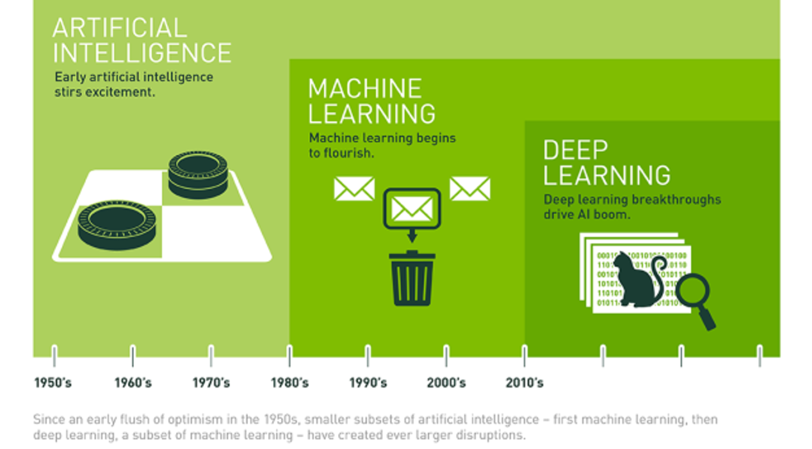

# 2.2. Why Deep Learning?

인공 지능\(AI: Artificial Intelligence\), 머신 러닝\(ML: Machine Learning\), 딥러닝\(DL: Deep Learning\)의 차이가 무엇일까? **Figure 3.**와 같이 엄밀히 세 단어는 포함 관계에 있다. 인공 지능은 머신 러닝 이외에도 언어학, 검색 서비스, 로보틱스 등 다양한 분야가 포함된 커다란 집합체이다. 머신 러닝은 말 그대로 데이터로부터 컴퓨터가 스스로 의미 있는 결과를 도출해내는 학문이다. 스스로 학습한다는 것을 조금 더 쉽게 풀자면 스팸 메일을 분류하기 위한 기준을 일일이 명시적으로 프로그래밍할 필요 없이, 데이터로부터 스팸 메일의 특징을 추출해내는 기술을 머신 러닝이라고 부를 수 있다. 마지막으로 딥러닝은 머신러닝의 한 갈래로, NN을 사용하여 은닉층\(Hidden layer\)을 깊게 만드는 구조를 이용한다. 딥러닝은 매스 미디어에서 각광을 받으며 떨친 유명세에 비해 주목을 받기 시작한 것은 불과 몇 년 되지 않았다. 그 이유에 대해서는 **1.1. Domain Knowledge** 에 언급한 바 있다.

그렇다면 왜 그렇게도 딥러닝에 열광하는 것일까?에 대해서는 박해선 님의 텐서플로우 블로그를 참고하자.

{% embed url="https://tensorflow.blog/%EC%BC%80%EB%9D%BC%EC%8A%A4-%EB%94%A5%EB%9F%AC%EB%8B%9D/1-3-%EC%99%9C-%EB%94%A5%EB%9F%AC%EB%8B%9D%EC%9D%BC%EA%B9%8C-%EC%99%9C-%EC%A7%80%EA%B8%88%EC%9D%BC%EA%B9%8C/" caption="" %}

