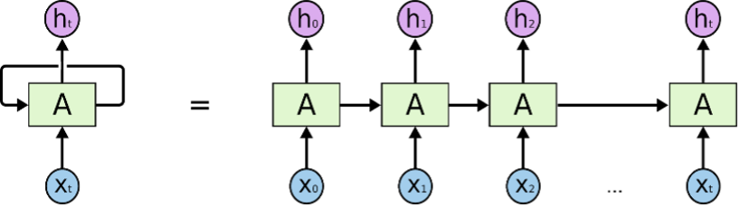
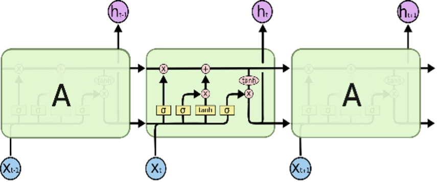

# 2.4. LSTM


  
시계열 예측 모델의 경우 순환 신경망\(RNN: Recurrent Neural Network, 이하 RNN\)과 RNN에서 발전한 형태인 장기-단기 기억 신경망\(LSTM: Long Short Term Memory, 이하 LSTM\)을 기반으로 한 모델이 널리 사용되고 있다. **Figure 4.**은 RNN의 모델을 간단히 다이어그램으로 나타낸 것이다. 순환 신경망이라는 이름과 걸맞게 입력으로 들어온 정보가 은닉층\(Hidden layer\)을 거쳐 출력되며, 이 출력이 다시 다음 단계의 새로운 입력으로 순환하는 형태의 모델이다. RNN은 순전파\(Feedforward\) 및 역전파\(Back propagation\)를 수행하여 가중치 파라미터를 갱신해 나간다.


**Figure 5.**의 LSTM은 RNN의 그래디언트 소실\(Gradient Vanishing\)과 폭주\(Exploding\) 문제를 해결하기 위해 고안된 알고리즘이다. RNN에 cell과 gate가 추가된 형태이다. cell은 과거의 정보를 보관하는 메모리 역할을 하며, gate는 과거의 정보를 얼마나 받아들이고 버릴지를 결정한다. 알고리즘에 대한 설명은 본 가이드의 주 목적이 아니므로 세부적인 내용에 대해서는 아래 영상 또는 다른 자료를 참고하길 바란다.



이렇듯 RNN 및 LSTM은 메모리 셀을 통해 시계열 적인 특성을 고려할 수 있다는 장점이 있어 순서가 중요한 정보 처리, 즉 시계열의 특성을 가지고 있는 데이터에 자주 사용된다. 예를 들어 주가 예측, 문장과 같이 단어의 순서가 문장의 의미에 중요한 영향을 미치는 기계 번역\(Machine Translation\) 등 회귀, 자연어 처리 분야에서 훌륭한 성능을 보인다. 본 가이드에서도 공학에서 만날 수 있는 여러가지 시계열 데이터에 대해 LSTM알고리즘 기반의 프로젝트를 소개한다.

