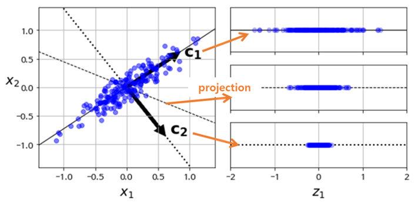
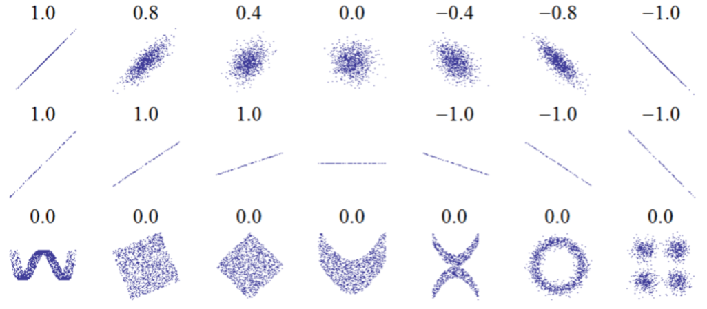

# 2.5. Data Processing

**2.2. Why Deep Learning?** 에서 딥러닝이 주목받기 시작한 것은 최근의 일이며, **1.1. Domain Knowledge**에서 그 이유를 설명하며 데이터의 중요성을 언급한 바 있다. 기계공학은 상품화할 수 있는 수준의 복잡도를 갖춘 머신 러닝 모델의 ‘러닝’에 필요한 데이터가 매우 많은 분야 중 하나이다. 예를 들어 공정 데이터의 경우 한 공정 단위로 주기성을 띠며 시계열의 특성을 가진 데이터인 경우가 매우 많으며, 시계열 분석을 통해 유용한 가치를 창출할 수 있는 경우가 많다.

보통 딥러닝을 실무에 적용할 때, ‘딥러닝 80/20 rule’이라는 것이 있다. 알고리즘을 익히면서 접하게 되는 예제에서는 이미 잘 정제된 데이터 셋을 사용하기 때문에 이 데이터 셋을 더 잘 학습할 수 있는 네트워크 구조, 손실 함수, 알고리즘 등에 초점을 맞추어 연구를 할 수 있다. 하지만 실무에서는 많은 경우 직접 수집한 데이터를 사용해야 하며, 수집한 데이터가 문제를 풀기에 충분한지 검증하고 신경망이 학습하기 쉽도록 데이터를 가공하는 과정에 훨씬 많은 시간을 투자하게 된다. 그만큼 머신 러닝 프로젝트에서는 실제 설계, 훈련하는 과정보다 좋은 데이터를 얻는 과정이 매우 중요하며 학습을 위한 준비 과정에 많은 시간을 소요하게 된다.

그렇다면 데이터는 어디서 확보할 수 있을까? 아래 **Table**에 프로젝트에 필요한 데이터를 확보할 수 있는 사이트를 여러가지 소개하였다.

| Sites | Contents |
| :--- | :--- |
| [https://www.kaggle.com/datasets](https://www.kaggle.com/datasets) | 다양한 머신러닝 경진대회를 주최하는 데이터 과학 커뮤니티 ‘Kaggle’에서 공개 |
| [https://registry.opendata.aws/](https://registry.opendata.aws/) | 아마존의 클라우드 업계 회사인 AWS에서 공개 |
| [https://archive.ics.uci.edu/ml/datasets.html](https://archive.ics.uci.edu/ml/datasets.html) | University of California, Irvine에서 제공 |
| [https://github.com/awesomedata/awesome-public-datasets](https://github.com/awesomedata/awesome-public-datasets) | 다양한 데이터를 분야별로 잘 정리해 github 주소이다. |

다음으로 데이터 처리 방법을 간단히 소개하고자 한다. 우리가 구할 수 있는 데이터는 보통 정제되어 있지 않으며 따로 전/후처리 과정이 필요하다. 데이터에서 유용한 정보를 뽑아내는 분석 방법은 여러가지가 있다. 특히 본 프로젝트에서 데이터 처리의 주 목적은 차원 축소이다. 데이터 축소를 통해 학습 과정의 시간 절약은 물론 학습 결과의 품질을 좋게 하는 등의 이점을 얻을 수 있다.

차원 축소의 방법에는 크게 특성 추출\(Feature Extraction\)과 타겟 특성과의 연관성이 높은 특성을 선택하는 특성 선택\(Feature Selection\)의 두 가지 방법이 있다. 전자의 경우 **Figure 6.**와 같은 PCA로 대표되며, 데이터의 분산을 최대한 보존하면서 서로 직교하는 새 기저 벡터\(Figure 내 c1, c2\)를 찾아 고차원 공간의 데이터들을 저차원 공간으로 투영\(Projection\)하는 기법이다.

한편, 특성 선택 과정은 일반적으로 SelectKBest 등의 함수를 사용하여 타겟 특성과 최대 관련성을 가지는 상위 K개의 특성들을 선택한다. 이 때 관련성의 지표인 Score Function은 분산 분석\(ANOVA: Analysis of Variance\)을 통해 구해진다.

또는 상관 계수를 기준으로 특성을 선택하는 방법도 있다. 상관 계수는 **Figure 7.** 의 예시 같이 -1에서 1 사이의 숫자로 표현되며 하나의 변수가 커질 때 같이 커지거나 반대의 경우로 나타나는 관계를 표현하는 계수이다. 일반적으로 데이터 축소 관점에서 상관 계수가 큰 것은 목표로 하는 특성과 관계가 깊다는 뜻으로 상관 계수가 큰 특성만을 선택하여 데이터를 축소하는 것도 가장 간편한 방법 중 하나이다.

다음으로 인과 관계 분석은 특히 시계열 데이터에서 큰 의미를 가진다. **Figure 8.** 을 살펴보면 X와 Y 데이터 간에 시간 지연\(Time Delay\)을 보상하면 거의 비슷한 진행 양상을 띠고 있는 것을 관찰할 수 있다. \(Y를 시간 지연만큼 앞쪽으로 이동시키면 X 와 매우 비슷해진다.\) 즉, X의 어떤 값 변동 양상에 의해 조금 뒤에 Y에도 비슷한 양상이 나타난다면, 두 변수 간에 인과관계가 성립한다고 생각할 수 있다. 두 변수의 진행 양상이 얼마나 일치하는지 뿐 아니라 두 변수의 상관관계, 두 변수의 크기 배율, 시간 지연 정도 등 모든 지표가 분석 대상에 포함될 수 있다.

시계열 문제에서는 차원 축소 과정도 시간 특성을 보존해야 하기 때문에 PCA, SelectKBest 함수를 사용하는 것보다도 조금 더 복잡한 이슈를 고려해주는 것이 좋다. 즉, 인과 관계를 분석하여 시간 특성을 최대한 활용하는 것이 좋다. 본 프로젝트에서는 교차 상관 함수\(CCF: Cross Correlation Function, 이하 CCF\)를 사용하여 데이터의 차원을 축소하는 방법을 소개한다.

마지막으로 당연하지만 분석 방법은 데이터나 해결하려는 목적에 따라 다르다. 본 프로젝트에서도 유용한 방법이 소개될 예정이나 엄연히 하나의 예시라는 것을 잊지 말자. 데이터들의 성격과 신경망의 목적과 설계에 따라 다양한 방법을 선택하면 된다.

