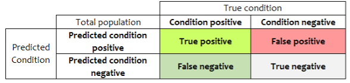
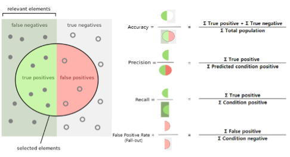
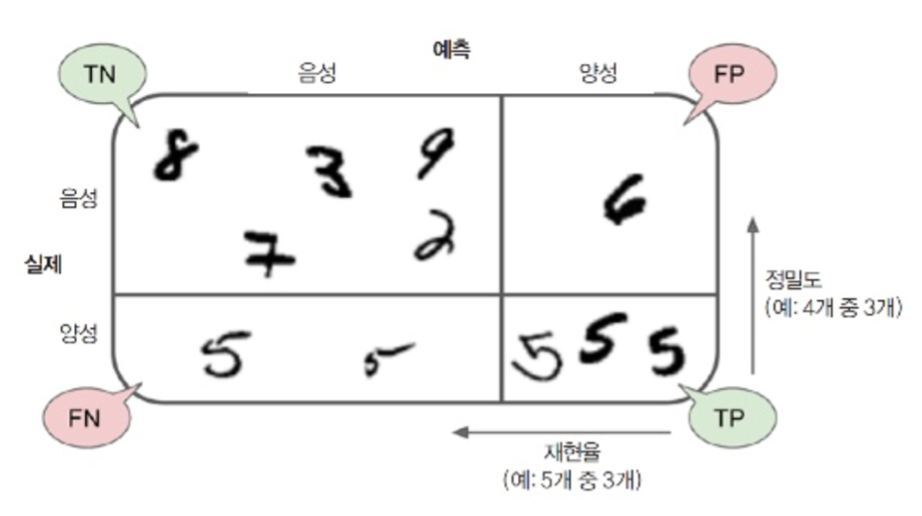

# 2.6. Confusion Matrix

머신 러닝 모델을 설계하고 학습한 이후에는 학습한 모델의 유용성을 검증하기 위해 모델 평가를 수행한다. 평가 지표에 대해서는 모델이 얼마나 정확한지 뿐 아니라 얼마나 정밀한지, 얼마나 실용적인지 등을 평가할 수 있는 지표가 존재한다. 분류 모델을 평가하는 요소는 매우 다양하지만 대표적으로 **Figure 8.** 의 오차 행렬\(Confusion Matrix\)를 소개한다.

| Terminology | Meaning | Ex\(불량 판별 시스템\) |
| :--- | :--- | :--- |
| TP\(True Positive\) | 실제 양성을 양성으로 분류 | 불량을 불량으로 정확 분류 |
| FP\(False Positive\) | 실제 음성을 양성으로 분류 | 양품을 불량으로 잘못 분류 |
| FN\(False Negative\) | 실제 양성을 음성으로 분류 | 불량을 양품으로 잘못 분류 |
| TN\(True Negative\) | 실제 음성을 음성으로 분류 | 양품을 양품으로 정확 분류 |

오차 행렬에서는 실제 클래스를 행에 나타내고, 분류 모델의 결과 클래스를 열로 나타내어 네 가지 경우의 수에 대해 위의 테이과 같이 명명한다. 정확하게 예측한 경우인 TP, TN의 경우 각각 진짜 양성, 진짜 음성이라 하며, 잘못 예측한 경우인 FP, FN은 각각 거짓 양성, 거짓 음성이라 한다. 완벽한 분류기의 경우 주대각 행렬만 0이 아닌 값을 가지게 된다. 이 오차 행렬 만으로 많은 인사이트와 정보를 얻을 수 있지만, 조금 더 직관적인 지표가 필요할 때도 있다.

| Terminology | Expression | Meaning | Example |
| :--- | :--- | :--- | :--- |
| 정확도\(Accuracy\) | $$\frac{TP+TN}{TP+FP+FN+TN}$$ | 정확하게 분류한 비율 | 불량과 양품을 정확 예 |
| 정밀도\(Precision\) | $$\frac{TP}{TP+FP}$$ | 양성으로 분류한 것 중 실제 양성 | 불량으로 예측한 것 중 실제 불량 샘플 |
| 재현율\(Recall\) | $$\frac{TP}{TP+FN}$$ | 실제 양성을 양성으로 예측 | 실제 불량 샘플을 불량으로 예측 |
| 오탐\(False Alarm\) | $$\frac{FP}{FP+TN}$$ | 실제 음성을 양성으로 예 | 실제 양품 샘플을 불량으로 예측 |

네 가지 정보를 바탕으로 위의 테이블과 같이 세 가지 평가 지표를 나타낼 수 있다. 정확도는 가장 많이 사용하는 지표이며, 정밀도와 재현율은 보통 함께 사용하는 것이 일반적이다. 만약 확실한 양성 샘플 하나만 가지고 분류를 했다고 했을 때, 정밀도는 100%로 완벽하다. 하지만 이 경우는 다른 모든 양성 샘플을 고려하지 못하는 것이기 때문에 재현율이라는 또 다른 지표와 함께 사용한다. 재현율은 모든 양성으로 분류된 샘플 중 정확하게 분류한 양성 샘플의 비율로 민감도\(Sensitivity\) 또는 진짜 양성 비율\(TPR: True Positive Rate, 이하 TPR\)이라고도 한다.

오차 행렬과 그 지표들에 대해 조금 헷갈린다면 다음 **Figure 9.**를 참고하면 이해에 도움이 될 것이다.

또는 **Figure 10.** 를 참고하여 분류 문제의 기초 예제인 MNIST데이터를 생각해보면 도움이 될 것이다. 위 **Figure 10.** 의 경우5를 분류해 내는 단일 분류 예제이다. 또는 귀여운 레고 블럭으로 정리한 예제가 있으니 아래 예시를 참고하여도 좋다.



| Terminology | Expression | Meaning | Example |
| :--- | :--- | :--- | :--- |
| TPR\(True Positive Rate\)=Recall | $$\frac{TP}{TP+FN}$$ | 예측과 실제가 모두 양 | 실제 불량 샘플을 불량으로 예측 |
| TNR\(True Negative Rate\) | $$\frac{TN}{FP+TN}$$ | 예측과 실제가 모두 음성 | 실제 양 샘플을 정상으로 예측 |
| FPR\(False Positive Rate\)=False Alarm | $$\frac{FP}{FP+TN}$$ | 실제 음성을 양성으로 예측 | 실제 양 샘플을 불량으로 예측 |
| FNR\(False Negative Rate\)=1-Recall | $$\frac{FN}{TP+FN}$$ | 실제 양성을 음성으로 예 | 실제 불량 샘플을 양품으로 예측 |

이 뿐 아니라 모델의 효율성을 평가하는 척도로 정밀도/재현율 곡선\(PR: Precision/Recall\) 곡선과 수신기 조작 특성\(ROC: Receiver Operating Characteristic, 이하 ROC\) 곡선이 있다. PR곡선은 오차 행렬의 지표 중 서로 트레이드 오프 관계에 있는 재현율과 정밀도를 축으로 한 그래프이다. ROC곡선은 모델의 효율성을 거짓 양성 비율\(FPR=False Alarm\)에 대한 진짜 양성 비율\(TPR=Recall\)의 곡선이다. 일반적으로 양성 클래스가 드물거나 거짓 음성\(FN\)보다 거짓 양성\(FP\)이 더 중요할 때는 ROC곡선보다 PR곡선을 사용하는 것이 좋다. 두 곡선에 대한 자세한 설명은 핸즈온 머신러닝 **3.3.4정밀도/재현율 트레이드오프, 3.3.5 ROC** **곡선** 파트 또는 아래 링크를 참고하도록 하고, PR곡선은 오른쪽 위 모서리, ROC곡선은 왼쪽 위 모서리에 가까울 수록 좋다는 것만 기억하자!



