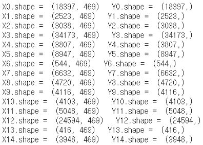
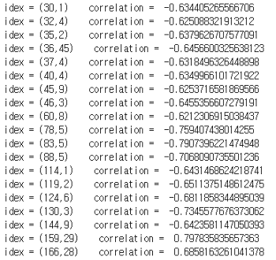

# 2.7. Project1: Fault Detection

앞서 기계공학에서 접할 수 있는 좋은 시계열 데이터로 공정에 대한 데이터를 언급하였다. 제조 회사에서 생산되는 제품의 불량 판별\(Fault Detection\)은 기업의 이익과 직접적인 관련이 있기 때문에 매우 중요하다. 전통적인 불량 판별 방법은 수작업이었으며, 사람에게 의존해야 하므로 오류 발생의 가능성이 크고 큰 비용이 발생하였다. 게다가 이 방법의 가장 치명적인 문제는 이미 불량이 발생한 후 불량품을 찾는 사후 처방적 방법이라는 것이다. 따라서 본 프로젝트에서는 머신 러닝을 활용하여 제조 데이터를 바탕으로 제품의 결함 뿐 아니라 결함 시기를 예측하는 불량 예측 모델을 구축할 것이다.

사용한 데이터는 압출기를 이용한 플라스틱 필름 생산 데이터이다. 압출기는 주로 플라스틱을 성형할 때 사용이 된다. 주로 원료를 혼합하고 기압, 토출 하는 용도로 사용되며 시트, 필름, 파이프, 튜브, 와이어, 케이블 절연 등의 제품 생산에 사용된다. 생산된 플라스틱 필름은 식품 등 다양한 제품의 포장 용지로 활용되므로 청결은 물론이고 무결함이어야 하기 때문에 생산 과정의 품질 관리가 매우 중요하다. 그러나 생산 환경이나 여러 가지 요인들에 의해 다양한 형태의 결함 발생이 불가피하다. 따라서 불량 예측 모델을 통해 생산 과정의 제품 결함을 줄여 비용 절감이 가능한 솔루션을 제공하는 것이 이 프로젝트의 목표이다. 또한 특성 분석을 통해 현업에서 주목해야 하는 특성들에 대해 인사이트를 제공하고, 설비자에게 20분 전 예상 결함에 알려줄 수 있도록 한다.

## Data Description



먼저 Kaggle 사이트에서 데이터를 다운 받아 자세히 살펴보자. 데이터 셋은 단일 타겟인 필름의 두께 특성과 나머지 469개의 특성\(Features\)으로 구성되어 있다. 총 470 개의 특성에 대해 2분 단위로 22만개의 샘플이 있다. 데이터가 매우 많기 때문에 전처리 과정에서 차원 축소를 고려할 것이다.

가장 먼저 타겟 특성\(Target Feature\)은 필름의 두께 정보로 설정하고, 결함 판단 기준은 필름의 두께 값을 통해 설정했다. 공정에 대해서 목표 필름 두께가 있으며 각 공정마다 필름의 두께가 목표한 값과 다를 경우 결함이 있다고 판단했다. 또한 목표 필름 두께는 공정 상 변경될 가능성이 있기 때문에, 두께 값 자체를 예측하는 회귀\(Regression\) 문제 보다는 정상적인 두께 값의 출력 유무를 판단하는 분류\(Classification\) 문제로 접근하는 것이 더 좋겠다고 판단하였다.

## Data Processing


데이터 처리 과정에 대해서는 **Project1\_Fault Detection &gt; 01\_Data\_Processing** 파일 참고하길 바란다.**Figure .\(a\)**와 같이 데이터의 모든 특성에 대해 Null인 부분을 기준으로 공정의 사이클이 나뉜다고 판단하였다. 따라서 Null Data를 삭제하고 이 부분을 기준으로 **Figure .\(b\)** 와 같이 데이터셋을 분할하였다.

다음으로 차원 축소 과정을 진행할 것이다. CCF를 사용하면 **Figure 13.**과 같이 교차 상관 계수의 값과 그 때의 시간지연 값을 반환할 수 있다. **Figure 13.** 는 절대 값이 0.6보다 큰 특성의 목록이며, Index의 첫번째 숫자는 특성 번호, 두번째 숫자는 시간 지연 값이다.

**Figure 14.**는 길이가 18000인 첫번째 샘플에 대해 **Figure 13.**에 해당하는 특성들의 CCF를 출력한 것이다. CCF 결과 타겟 특성과의 교차 상관 계수가 0.9이상인 특성들은 모두 시간 지연이 나타나지 않았다. 따라서 인과 관계가 없다고 판단하여 제외하였다. 타겟과의 상관계수의 절대값이 0.6 보다 큰 값을 가지며 시간 지연이 생기는 특성들 중, 다른 피쳐들과 독립적인 8개의 특성\(130, 156, 157, 253, 274, 278, 288, 465\)을 최종적으로 선택하였다.

조금 더 직관적으로 이해해보자. 예를 들어 레이놀즈 수를 구성하는 변수는 밀도, 속도, 점성 계수 등이 있을 것이다. 만약 이 정보들이 모두 계측이 되고 있다면 이들은 굉장히 중복되는 특성일 것이다. \(물론 비례, 반비례 관계에 따라 다를 것이다.\) 즉, 이 변수들끼리 CCF를 한다면 굉장히 높은 교차 상관 계수가 나올 확률이 높다. 변수들끼리의 상관 계수가 높다면 그 중 가장 대표적인 것 하나만 채택해도 될 것이다. 이에 대해 어떤 변수를 택할 것인지, 중복되는 변수 중 몇 개를 택할 것인지에 대해서도 도메인 지식의 개입이 필요할 가능성이 높다.

**Figure 15.**는 최종적으로 선택한 8개의 특성의 배타 독립성을 CCF를 통해 확인한 것이다. 그래프 개형을 통해 특성들이 모두 배타적인 것을 확인할 수 있다.

## 배치 사이즈\(Batch Size\) 결

딥러닝은 작은 배치 데이터를 반복적으로 훈련한다. 배치사이즈는 학습 샘플의 Sequence length이며, 따라서 배치 사이즈가 작을수록 메모리 효율성이 커진다. 그렇다면 배치 사이즈를 어떤 기준으로 정해야 할까? 배치 안에 어떤 현상이 일어나고 없어지기 까지가 포함이 되어야 한다. 즉, 데이터가 가지고 있는 사이클을 반영하기 위해 적어도 사이클의 2-3배 정도로 정해주어야 한다. 앞서 특성 선택 과정에서 CCF를 고려하였다면, 이번에는 적절한 배치사이즈를 결정하기 위해 자기 상관 함수\(ACF: Auto Correlation Function, 이하 ACF\)를 고려할 것이다. 자기 상관 함수는 동일한 변수를 시점을 달리하여 관측하였을 때 다른 시점의 관측값들 사이의 상호 연관 관계를 나타내는 척도이다. 현재가 과거 또는 미래의 데이터와 밀접한 연관을 가지고 있다면 이 시계열 데이터는 자기 상관이 있다고 볼 수 있다. 따라서 데이터의 사이클을 확인하기 위해 ACF를 사용한다.

자기 상관 함수는 상관 계수와 마찬가지로 -1에서 1 사이의 값을 가진다. 양의 자기 상관이 있다는 뜻은 자기 자신의 변화에 대해 과거 자기 자신의 영향을 받는다는 말로, 데이터에 패턴이 존재하는 경우라고 생각할 수 있다. 양의 자기 상관이 있는 변수의 전형적인 ACF 그래프는 **Figure 16\(a\).**와 같은 형상으로 나타난다. 첫 값은 자기 자신과의 상관 계수로 1이며, 작은 크기의 시차에 대한 ACF일수록 큰 양의 값을 가지며 떨어지는 경향이 있다. 이는 시간적으로 가까운 관측치들은 그 관측값이 서로 비슷하기 때문이다. 즉, 초기 시점을 기준으로, 초기 시점과 가까울 수록 초기 시점에 영향을 많이 주기 때문에 ACF가 1\(혹은 양수\)에서 빠르게 감소하다가 일정 타임 스텝\(Time-step\)이 지나면 영점 교차\(Zero-Crossing\)가 일어나는 양상을 보인다. **Figure 16\(b\).**는 미니 배치 사이즈를 100으로 한 후 모든 배치에 대하여 자기 상관을 확인하고 평균을 낸 그래프이다. 타임 스텝 30에서 영점 교차가 일어나므로 배치 사이즈는 30이상으로 설정할 것이다. 본 프로젝트에서는 데이터사이클의 2배 정도를 고려해주기 위해 배치사이즈를 60으로 설정하였다.

## Fault Detection Model


결함 예측 모델의 경우 **Project1\_Fault Detection &gt; 03\_Extruder\_Failure\_Detection\_Regression**를 참고하자. 분류 문제를 수행하기 위해 손실함수를 ‘binary\_crossentropy’로 지정하였으며, 0에서 1 사이의 값을 반환하는 시그모이드\(Sigmoid\)함수를 활성화 함수로 사용하여 예측 모델을 완성하였다. ‘분류’ 문제임에도 불구하고 ‘회귀’ 문제에 자주 쓰이는 LSTM을 사용하는 이유는, 데이터의 시계열 특성을 반영 해주기 위해서이다. 회귀 문제로 접근한 예시도 있으니 \(**Project1\_Fault Detection &gt; 04\_Extruder\_Failure\_Detection\_Classification\_model\)** 참고해도 좋다.

**Figure 17.**은 설계한 모델의 예측 결과이다. 더 많은 스텝을 예측하려 할수록 예측 결과에서 시간 지연이 발생하는 것을 볼 수 있다.

| Step | Accuracy | Recall | Precision | FNR | FPR |
| :--- | :--- | :--- | :--- | :--- | :--- |
| 1 Step | 0.9912 | 0.9632 | 0.9628 | 0.0368 | 0.0061 |
| 2 Step | 0.9859 | 0.9351 | 0.9318 | 0.0649 | 0.0112 |
| 3 Step | 0.9817 | 0.9068 | 0.8995 | 0.0932 | 0.0164 |
| 4 Step | 0.9779 | 0.8810 | 0.8705 | 0.1190 | 0.0212 |
| 5 Step | 0.9739 | 0.8559 | 0.8418 | 0.1441 | 0.0259 |
| 6 Step | 0.9701 | 0.8303 | 0.8130 | 0.1697 | 0.0306 |
| 7 Step | 0.9658 | 0.8044 | 0.7845 | 0.1956 | 0.0350 |
| 8 Step | 0.9609 | 0.7811 | 0.7606 | 0.2189 | 0.0390 |
| 9 Step | 0.9555 | 0.7595 | 0.7394 | 0.2405 | 0.0425 |
| 10 Step | 0.9500 | 0.7374 | 0.7184 | 0.2626 | 0.0460 |
| 11 Step | 0.9445 | 0.7163 | 0.6980 | 0.2837 | 0.0497 |
| 12 Step | 0.9390 | 0.6960 | 0.6782 | 0.3040 | 0.0533 |
| 13 Step | 0.9332 | 0.6742 | 0.6570 | 0.3258 | 0.0571 |
| 14 Step | 0.9278 | 0.6534 | 0.6369 | 0.3466 | 0.0608 |
| 15 Step | 0.9227 | 0.6345 | 0.6187 | 0.3655 | 0.0641 |

단계별 예측 모델의 정확도, 재현율, 정밀도, FNR을 위 테이블 나타내었다. 제조 품질 불량 경보 시스템의 목적으로부터 비추어볼 때, 양성 클래스가 드물다는 점에서 전자는 만족하지만 오탐 상황\(FPR\)보다 불량을 찾지 못하는 경우\(FNR\)에 더 문제가 될 수 있기 때문에 후자의 상황이라고 보기 어렵다. 따라서 정확도, 재현율, 정밀도와 함께 FNR을 주요 지표로 선택하였다.

결과적으로 10 단계까지의 정확도는 95%이상 이며, 15 단계까지의 정확도는 92%이상으로 정확도만 본다면 불량 경보 시스템의 유용성이 충분하다고 판단하였다. 하지만 재현율과 불량을 감지하지 못한 FNR을 살펴보면 예측 Step이 길어질수록 그 성능이 떨어지는 것을 확인 할 수 있다. 이 부분의 성능 개선은 Future Work로 제안한다.

결과를 바탕으로 공정에서 10~15 스텝\(약 20~30분\)후의 불량을 예측하고, 미리 경고할 수 있는 ‘제조 품질 불량 경보 시스템’을 설계할 것이다. 15스텝 이전\(30분 전\)에 불량을 감지했다면 황색등\(Yellow Light\)으로, 이후 5스텝 이전\(10분 전\)까지 그 불량 예측이 유지된다면 적색등\(Red Light\)으로 불량 경보를 발령하도록 할 것이다.

