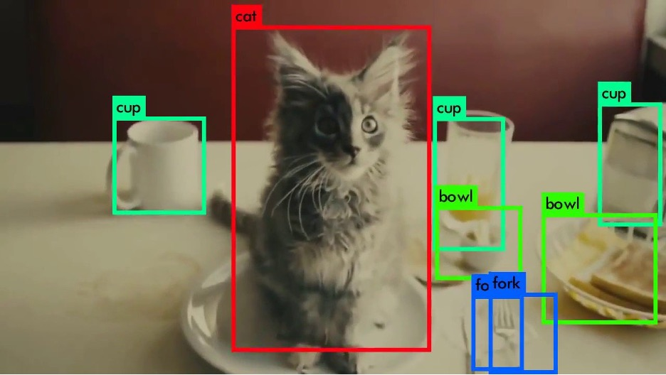
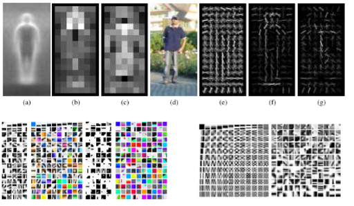
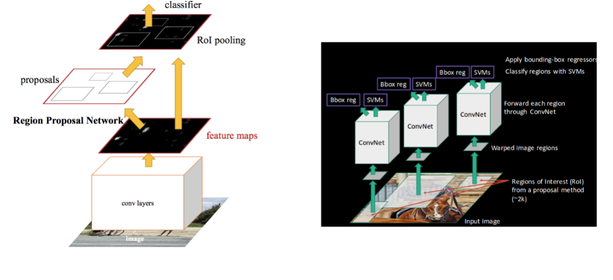

# 3.1. Why use ML in LPR?

3장에서는 머신 러닝의 객체 인식\(Object Recognition\)을 활용한 차량 번호판 인식\(LPR: License Plate Recognition, 이하 LPR\) 프로젝트를 소개하려 한다. 객체 인식은 **Figure 18.**과 같이 특정 이미지에서 테두리 상자\(Bounding Box\)를 통해 영역을 설정하고, 해당 영역 내 물체의 존재 유무 또는 물체의 종류를 판별하는 것을 목표로 하는 과제이다.

우선, YOLO라는 객체 인식 머신 러닝 알고리즘을 통해 차량 번호판\(LP: License Plate, 이하 LP\)을 인식한다. 그 이후의 과정은 컴퓨터 비전 오픈소스 라이브러리인 OpenCV를 통해 인식하기 쉬운 형태로 이미지 프로세싱을 하여 파이썬 내장 라이브러리인 tesseract를 통해 글자를 인식할 것이다. \(지금은 간단하게 언급하고 이후 각 도구들에 대한 설명을 추가하였으니 걱정하지 않아도 된다.\)

본 프로젝트에서 가장 많은 시간을 소요하는 부분은 OpenCV를 활용하는 이미지 프로세싱 과정이다. 물론 이미지 프로세싱도 머신 러닝의 일부이며 OCR 은 수십 년 전부터 사용된 머신러닝 애플리케이션이다. LPR에서 가장 중요한 부분은 LP를 신속, 정확하게 탐지하는 것이며 객체 인식 성능이 곧 LPR시스템의 성능을 좌우한다고 할 수 있다. 객체 인식 알고리즘 중 하나인 YOLO\(You Only Look Once\) 라는 머신 러닝 객체 인식 알고리즘은 LPR의 성능을 높이는 매우 중요한 역할을 한다.

전통적인 영상처리에서 사용했던 객체 인식 알고리즘은 특징 엔지니어링\(Feature Engineering\)기법을 주로 사용하여 **Figure 19**.와 같이 물체를 대표할 수 있는 특징을 추출\(Feature Extraction\)하고, 특징들의 분포에서 분류\(Classifier\)알고리즘을 통해 경계 결정을\(Boundary Decision\)을 찾는 파이프라인을 따랐다.

하지만 최근에는 딥러닝 중 합성 곱 신경망\(CNN: Convolutional Neural Network, 이하 CNN\)이 이미지 인식 쪽에서 엄청난 성능을 증명한 후, **Figure 20.**와 같이CNN 기반의 다양한 객체 인식 알고리즘이 발전되어왔다. 머신러닝을 사용하는 객체 인식 방식은 이미지 전처리, 특징 추출의 과정을 신경망이 대신하여 매우 빠르고 훌륭한 성능을 낼 수 있다는 점에서 매우 많이 사용되고 있다.

