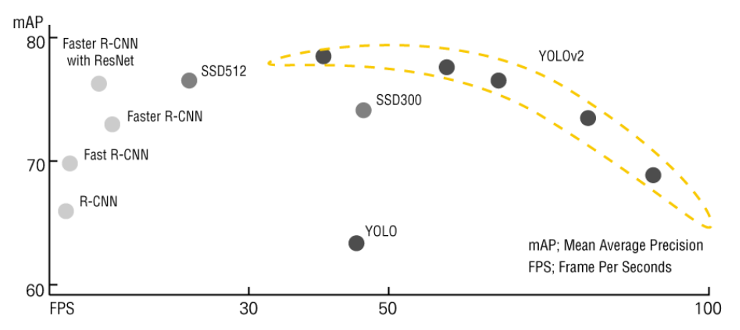

# 3.2. Why YOLO?

**Figure 21.** 의 그래프는 객체 인식 정확성을 나타내는 척도인 mAP, 신속성을 나타내는 척도인 FPS 두가지 지표를 기준으로 다양한 객체 인식 모델의 특징을 나타냈다. 이를 통해 R-CNN 계열의 모델은 일정 수준의 정확성은 확보할 수 있으나, 실시간 프로그램에 적용하기에 신속성이 떨어지는 문제가 있음을 확인할 수 있다. 따라서 최근에는 일정 수준의 정확성을 유지하며 객체 인식의 속도를 높이는 여러 신경망들이 개발되고 있으며 대표적으로 SSD계열과 YOLO가 있다.

**본 프로젝트의 최종 목표는 움직이는 차량에 대해** **LPR을 수행하는 것**으로 정확성과 신속성을 모두 필요로 한다. 따라서 객체 인식 모델로 YOLO를 선택하여 차량 번호판을 인식하고 Py-tesseract 라이브러리를 통해 OCR작업을 하여 차량번호판 내의 문자를 인식하는 모델을 만드는 것이 프로젝트의 목표이다.

