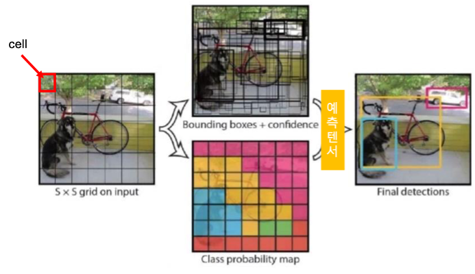
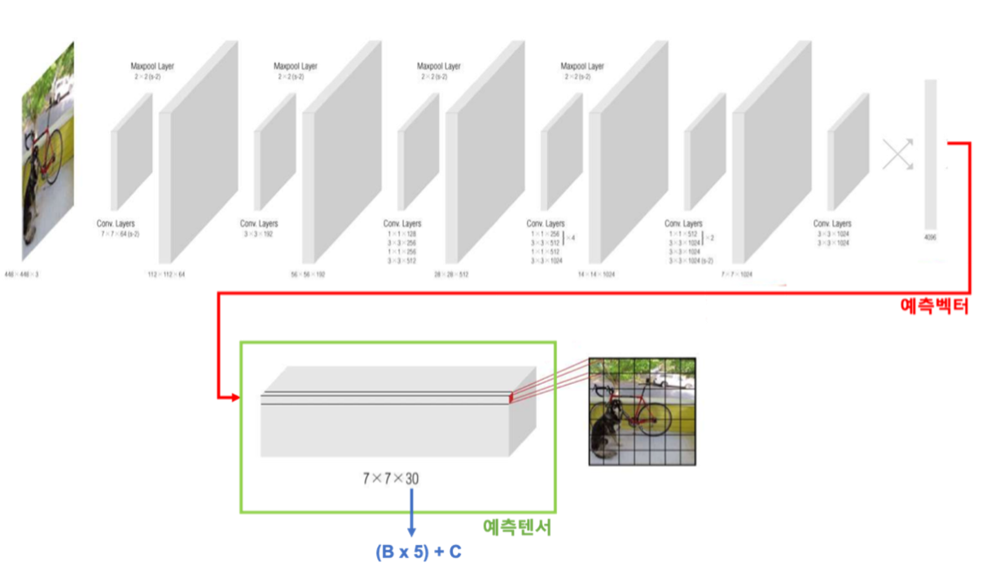

# 3.3. Object Recognition: YOLO


앞서 언급했듯, 본 프로젝트의 핵심 기술인YOLO네트워크는 객체 인식 딥러닝 모델이며, 기존 모델과 구별되는YOLO의 가장 큰 특징은 실시간이 가능할 정도로 빠른 인식 속도이다. 기존 R-CNN의 경우 한 장의 이미지에 인식하고자 하는 물체의 개수가 여러 개인 경우, 한 장의 이미지를 물체의 개수만큼 중복하여 모델의 입력으로 사용해야 한다. 반면, YOLO의 경우 직관적인 이름에서 알 수 있듯 한 장의 이미지에 있는 여러 개의 물체를 한 번에 인식한다. 이러한 이유로YOLO는 실시간 구현이 가능할 정도의 빠른 신속성 확보가 가능해진다. R-CNN계열의 가장 개선된 모델인 Faster R-CNN이 10 FPS 미만의 신속성을 띠는 반면 YOLO는 기본 네트워크만으로 45 FPS 정도의 의 신속성을 보여준다.


YOLO는 **Figure .** 과 같이 입력 이미지에 대해 테두리 상자를 생성\(Bounding Box Coordinate\)하는 것과 분류\(Classification\)를 위한 class probability map을 생성하는 과정을 동일 신경망 구조를 통해 동시에 실행하는 통합인식\(Unified Recognition\)을 수행한다. 즉, 입력 이미지에서 물체의 종류와 위치를 한번에 예측하게 된다. 먼저 입력 이미지를 S×S 형태의 격자로 나누며 격자로 나누어진 것을 셀\(cell\)이라 한다. 이미지 전체를 신경망에 넣고 특징 추출을 통해 각 셀의 예측 정보를 담은 예측 벡터를 반환한다. 이 예측 벡터가 셀의 개수만큼 모여 예측 텐서가 된다. 예측 텐서는 셀 별 테두리상자 정보, 분류 클래스 확률 등을 포함한다.


이 예측 텐서를 바탕으로 YOLO모델의 비용함수를 계산하여 테두리 상자 조정 및 분류 작업을 수행하며 이 과정이 YOLO네트워크의 학습 과정이 된다. 학습의 주 정보가 되는 예측 텐서에 대해 조금 더 자세히 살펴보면, 예측 텐서는 **Figure .** 과 같이 CNN, FC 연결층을 거쳐 S×S×\(B×5+C\)의 형태로 반환된다. 여기서 S×S 는 셀의 개수, B는 각 셀 내부 영역에서 중점을 가지는 테두리 상자\(Bounding Box\)의 개수이고, C는 분류하고자 하는Class의 개수 이다. 상수 5는 각각의 테두리 상자가 가지고 있는 5개의 예측 정보로 상자의 중심 위치 좌표 \(x, y\), 전체 이미지에 대한 테두리 상자의 상대 너비와 상대 높이\(w, h\), 물체가 테두리 상자 안에 얼만큼 포함이 되어 있는지에 대한 지표인 confidence score가 포함된다. **Figure .** 의 예시는 S=7, B=2, C=20 인 경우로 7×7×30 형태의 예측 텐서가 반환된다.

