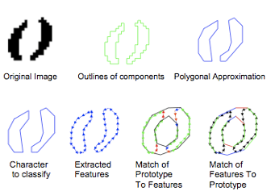

# 3.4. OCR: Tesseract

Tesseract는 다양한 운영체제에서 사용할 수 있는 광학 문자 인식\(OCR: Oprical character recognition, 이하 OCR\)엔진이다. Tesseract의 버전이 올라감에 따라 딥러닝 기반의 인식 엔진을 도입 하였고, 버전 4에서는 Recurrent Neural Network\(RNN\)의 일종인 Long Short Term Memory\(LSTM\) 기반 인식 엔진을 구현하였다.

Tesseract는 이미지의 특징점을 추출하고, 그 특징점을 사용하여 문자를 인식한다. **Figure 24.**와 같이 기존 이미지에 테두리를 생성한 후 노이즈를 제거하는 방식으로 문자의 포괄적인 특징점을 추출한다. 이후Tesseract 데이터 베이스 검색을 통하여 특징점이 비슷한 문자를 매칭하고, 오차율이 가장 낮은 문자를 선택하여 반환한다.

