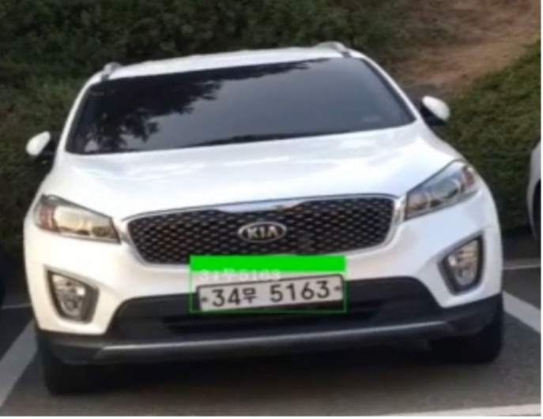

# 3.5. Project2: LPR

객체 인식 프로젝트는 기본적으로 이미지를 처리하는 분야이기 때문에 OpenCV를 사용한다. 코드는 **Project2\_Object Detection &gt;** **Plate Recognition Colab Code**를 참고하면 된다. OpenCV는 영상이나 이미지를 읽어들이고 여러가지 처리를 수행하여 다시 파일로 내보내는 등 영상처리와 컴퓨터 비전을 위한 오픈소스 라이브러리이다. 구글 Colab을 사용한다면 기본적으로 OpenCV를 지원하기 때문에 별도 설치를 하지 않아도 라이브러리 import를 통해 간단하게 사용할 수 있다.

**Figure 25.**는 YOLO 네트워크를 사용하여 한 장의 이미지에 대해 LPR을 수행한 결과이다. 인식한 LP를 이미지 내 관심영역\(ROI: Region of Interest, 이하 ROI\)로 설정하고 이를 크롭하여 여백 제거, 레이아웃, 수평도 등을 조절하여 ROI이미지를 만들어준다. **4.1.**의 물체 인식 과정에서 이미지 프로세싱의 중요함을 언급한 바 있다. Tesseract를 사용하여 OCR을 성공적으로 수행하기 위해서도 이 과정이 매우 중요하다.

| step | filter | role |
| :--- | :--- | :--- |
| 1 | Grayscale | 이미지 처리가 쉽도록 광도 정보만 추출하여 회색조 변환 |
| 2 | BlackHat\(BottomHat\) | 밝은 배경의 어두운 개체를 도드라지게 해주는 역할, LPR 등 글자를 인식해야 하는 객체 인식에 많이 활 |
| 3 | Thresholding | GaussianBlur를 통해 백색 노이즈 제거 후 흑백조 전환 |
| 4 | Find Contours | 윤곽선 찾 |

**Figure 26\(a\).**의 각 전처리 단계에 대한 세부 과정은 **Table 9.** 로 함께 나타내었다. **Figure 27.**은 세 번째 단계 중 Gaussian Blur의 효과를 나타낸다. 흑백조 변환 과정에서 백색 노이즈를 많이 줄여 인식률을 높이는 역할을 함을 알 수 있다. **Figure 26\(a\).**와 **Table 9.**의 과정을 거쳐 윤곽선을 찾고 나면 **Figure 26\(b\).**와 같이 윤곽선을 감싸는 사각형을 그려준다. 번호판 내에도 여러가지 윤곽선이 존재하기 때문에 여러 개의 사각형이 그려지는데, 글 자의 가로 세로 비율과 글자 사이 간격 등을 고려하여 글자의 사각형 만을 뽑아내도록 필터링하는 과정이다. 또한 사진의 각도에 따라 LP의 이미지가 수평이 아닌 경우가 빈번할 수 있기에, 이 과정에서 그려진 사각형을 일렬로 배치시켜 수평도 보정을 하는 것도 가능하다.

이미지 프로세싱 과정을 통해 최종적으로 차량 번호판의 OCR을 수행한 결과는 **Figure 28.** 와 같다. 지금까지 이미지에 대해 LPR을 진행하였다면, 영상에 대한 LPR을 진행하여 실험을 고도화하였다.

앞서 언급하였듯 본 프로젝트의 최종 목적은 움직이는 차량에 대해 성공적으로 LPR을 수행하는 것이다. 비즈니스 모델로의 고도화를 위해서는 실시간 구현이 불가피하다. 하지만 실시간 구현에는 본 글의 범위에서 벗어난 여러가지 이슈가 존재하며, 본 프로젝트의 주 목적은 실시간 구현이 아닌 머신 러닝의 적용이기 때문에 실시간 구현에 대한 문제는 제외한다. 따라서 휴대전화를 사용하여 영상을 촬영하여 영상을 분석하는 방식을 통해 실험을 진행하였다.

영상에 대해 이미지 LPR과 동일한 방법으로 LPR을 수행한 후, 유니코드를 지원하는 PIL 라이브러리에 있는 ‘draw.text’ 함수를 사용하여 수행 결과를 실시간으로 출력하였다. 이 과정에서 OpenCV 기반 함수인 ‘put text’ 함수를 사용하면OpenCV는 유니코드를 지원하지 않기 때문에 한글 출력에 오류가 생기니 주의하도록 하자.

