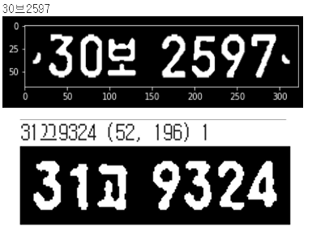
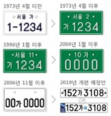
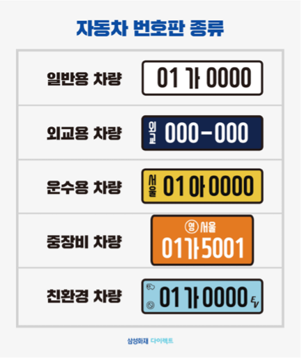
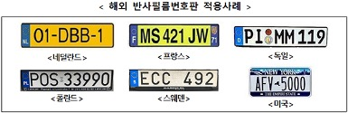

# 3.6. Issues & Future Work

OCR은 언어/문자별로 인식률의 차이를 보인다. 영어나 서유럽 언어 같은 경우 알파벳을 가로로 일렬로 쭉 배열하는 형태이기 때문에 인식률이 매우 뛰어나다. 반면 한 글자의 구조가 복잡한 한글이나 한자같은 문자는 잘못 인식되는 경우가 많다. 한글에 비슷한 글자가 많다는 사실도 인식률을 낮추는 데 크게 기여하는 부분 중 하나이다. 특히 ‘관’을 ‘판’으로 인식하는 오류가 가장 심해서, “-에 판하여”를 검색하면 굉장히 많은 문서가 나온다고 한다. \(ㅋㅋ\)

본 프로젝트에서도 이 부분에서 어려움이 있었다. **Figure 7.** 에서 확인 할 수 있듯이, ‘보’를 ‘브’라고 인식을 하거나, ‘고’를 ‘끄’라고 인식 하기도 하였다. 이미지에서의 OCR 수행에서는 치명적인 오류로 작용할 수 있으나, 영상에서는 설정한 프레임마다 한번씩 OCR을 수행하여 빈도 수가 높은 글자를 출력하는 방식 등을 통해 신뢰도를 향상시킬 가능성이 있다.

마지막으로 본 프로젝트에 이어 고도화가 가능한 Future Work을 다음과 같이 제안한다. 본 프로젝트를 진행한 신형 일반용 LP말고도 여러가지 종류의 LP가 존재한다. **Figure 31\(a\)** 처럼 흔히 ‘초록색 번호판’이라고 하는 지역명이 포함된 구형 번호판이 대표적이다. 뿐만 아니라 일렬 배치인 신형 번호판과 달리, 구형 번호판은 2열 배열을 가지고 있다. 또한 **Figure 31\(b\)** 와 같이 차의 용도에 따라 색상, 글자와 숫자의 배치가 다르며 마크 등이 포함되기도 한다.

**Figure 32.** 와 해외 LP의 경우 지정된 각각의 형식이 있고, 2020년 7월부터는 위·변조 방지를 위해 국가 축약 문자, 국가 상징 문양 등을 포함한 반사 필름 번호판을 도입하였다. 이렇듯 다양한 형식에 따라 차종, 국적을 함께 인식하는 LPR모델로의 고도화가 가능하다.

