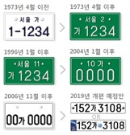
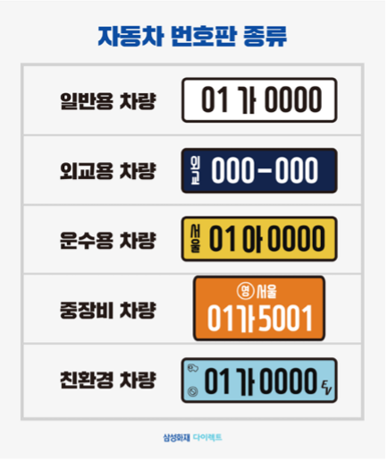

# 3.7. Future Work

마지막으로 본 프로젝트에 이어 고도화가 가능한 Future Work을 다음과 같이 제안한다. 본 프로젝트를 진행한 신형 일반용 LP말고도 여러가지 종류의 LP가 존재한다. **Figure 31\(a\)** 처럼 흔히 ‘초록색 번호판’이라고 하는 지역명이 포함된 구형 번호판이 대표적이다. 뿐만 아니라 일렬 배치인 신형 번호판과 달리, 구형 번호판은 2열 배열을 가지고 있다. 또한 **Figure 31\(b\)** 와 같이 차의 용도에 따라 색상, 글자와 숫자의 배치가 다르며 마크 등이 포함되기도 한다.

**Figure 32.** 와 해외 LP의 경우 지정된 각각의 형식이 있고, 2020년 7월부터는 위·변조 방지를 위해 국가 축약 문자, 국가 상징 문양 등을 포함한 반사 필름 번호판을 도입하였다. 이렇듯 다양한 형식에 따라 차종, 국적을 함께 인식하는 LPR모델로의 고도화가 가능하다.

