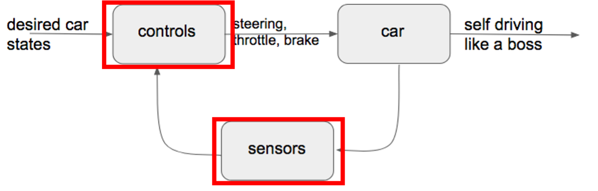

# 4.1. Why use ML in Self-driving?

자율주행은 4차 산업혁명 첨단 기술의 집약체로, 기술 협력과 융합이 가속화 되고 있는 분야이다. 최근 머신 러닝이 접목되면서 더욱 그 발전 가능성이 무한해졌으며 연구/개발도 활발히 진행되고 있다. 4장에서는 머신 러닝 중에서도 강화학습 기반 자율주행 프로젝트를 소개한다.

자율주행 시스템의 대략적인 구조는 **Figure .** 과 같이 제어부, 차체, 계측부 세 부분으로 생각할 수 있다. 머신 러닝을 자율주행 제어부에 접목시킴을 통해 조금 더 경제적이고 효율적인 제어 시스템이 구현 가능하다. 일례로 구글이 처음 자율주행 자동차를 개발했을 때, 170여 명의 개발팀이 약 4년 이상의 주행테스트를 걸쳐서 자율 주행 기술을 구현하였다. 그러나 2016년 콤마닷에이아이\(comma.ai\)라는 회사에서는 AI 기술을 활용하여 단 4명의 개발자로 4주만에 인공지능을 활용해서 자율주행 기능을 구현해냈다. 자율주행의 핵심 기술로 ‘딥러닝’이 주목을 받는 이유라고 할 수 있다.

딥러닝의 기술적 경쟁력은 자율주행 기술 개발의 패러다임 측면에 큰 영향을 미쳤다. 기존에는 자율주행 기능 구현을 위해 고가의 특화 센서를 사용했다. 실제 구글이 자율주행 자동차 개발 초기 사용된 자동차 1대의 가격 또한 1.7억원이었으며, 그 중 라이더 센서 하나의 가격이 8천만원에 달했다. 하지만 고가의 특화 센서를 저가의 범용 센서가 빠르게 대체하고 있으며 이제는 자본이 아닌 데이터의 확보가 자율주행 기술의 핵심이 되고 있다.

하지만 데이터마저 확보할 필요가 없다면 어떨까? 강화학습은 trial and error를 통해 보상과 패널티를 주는 방식으로 에이전트를 학습시킴으로써 딥러닝의 데이터 의존 문제 해결 가능하게 한다.

\(물론 domain knowledge와 reward function 설계를 위해 어느정도의 데이터가 필요하다.\)

