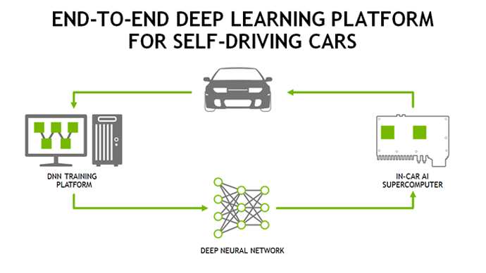

# 4.2. Why Reinforcement Learning?

강화학습은 에이전트가 수행하는 행동의 결과로 나타나는 보상을 통해 어떤 것이 최적의 정책인지 학습하는 머신 러닝 방식이다. 강화학습은 인공지능 중에서도 제어 공학과 비슷한 성격을 가지고 있으며 자율주행 외에도 로봇공학, 드론 제어 분야, 게임 등 현재 다양한 분야에서 활용되고 있다.

**Figure 34.**와 같이 자율주행에 필요한 중간 기능 분류 없이 운전 과정 전체를 학습하는 방식을 엔드투엔드라고 한다. 엔드투엔드 자율주행 시스템은 운전에 필요한 센서 데이터를 직접 입력 받고 다양한 운행 상황에 대해 학습한 후 조향과 액셀러레이터, 브레이크 값을 직접 출력해낸다. 즉, 딥러닝 알고리즘 안에서 인지∙판단∙제어 기능이 처음부터 끝까지 네트워크로 구현되는 것이다. 엔드투엔드 방식을 자율주행 자동차에 적용하면 새로운 운행 환경과 관련해 추가 기능이 필요할 때 인지∙판단∙제어 알고리즘을 매번 재설계하거나 변경하지 않고, 새로운 상황에 대한 데이터를 추가해 학습함으로써 자율주행 시스템을 구현할 수 있다.

머신 러닝 기반 엔드투엔드 학습 방식엔 운전자\(사람\)의 운행 방식을 **데이터**로 수집, 이를 모방하는 딥러닝 방식과 **시뮬레이터**를 이용해 가장 최적화된 운전 방식을 스스로 학습하는 강화학습 기반 방식이 있다. 딥러닝 방식은 지도학습의 한 갈래이며 Example-driven training이라고 부르기도 한다. 즉, 기술 구현에 활용될 Example 데이터에 대한 의존도가 매우 높으며 이 데이터의 질이 매우 중요하고, 수집한 데이터와 너무도 다른 환경에서 주행하게 된다면 성능이 떨어질 수 있다는 한계가 존재한다.

또한 인공지능 기술을 활용하지 않는 기존 제어 이론과 비교했을 때, 강화학습은 최적제어\(Optimal Control\)이론과 목적이 같으며 그 목적은 최적 경로를 찾는 것이다. 목적이 같은 만큼 두 알고리즘은 많은 면에서 유사한 모습을 보이며 자주 비교되곤 한다. 강화학습이 공학적 제어 문제의 해결에 자주 활용되는 이유이기도 하다.

| Step | Dynamic Programming\(RL\) | LQR Control\(OC\) |
| :--- | :--- | :--- |
| Modeling | $$p(s',r|s,a)$$  | $$\dot{x}=Ax+Bu$$  |
| Objective function | $$G_t=R_{t+1}+\gamma R_{t+2}+\gamma^2R_{t+3} ...$$ | $$J=\int_{0}^{\infty }(x^TQx+u^TRu)dt$$ |
| Policy making | $$v_\pi(s)=E_\pi[G_t|S_t=s]$$ $$\pi = argmax v(s,a)$$  | Q 와 R\(가중치\) decide |
| Optimal solution | 모든 상태의 v update | $$u=Kx$$\(K is gain which minimize J\) |

조금 더 구체적으로 강화학습의 기초 알고리즘인 Dynamic Programming과, 현대제어의 최적제어 이론 알고리즘인 LQR control 을 살펴보자. 두 알고리즘은 위 테이 에서 확인할 수 있는 것처럼 용어와 계산하는 과정만 조금 차이가 있을 뿐, 거의 동일한 개념과 구조를 갖고 있다. 목적함수를 결정하고 목적함수를 최대화 하기 위한 정책을 결정한 후, 목적함수와 정책을 이용하여 목적함수가 최대가 되는 경로를 찾는다. 엄밀히 말해 강화학습에서는 주로 목적함수의 최대값을 찾고, 최적제어에서는 performance measure라 불리는 목적함수 J의 최소값을 찾지만, 기본 원리는 동일하다.

모델링은 제어 시스템의 성능을 좌우하며 제어이론에서 정확한 모델링은 매우 중요하다. 모델링은 제어를 하고자 하는 대상의 운동방정식을 말하며 어떤 물체에 작용하는 힘 요소들을 모두 알고, 수치화 한다는 뜻이다. 자동차의 경우 차량 동역학을 통해 구현될텐데, 이 식은 매우 복잡하고 고차의 미분방정식으로 표현될 것이다. 어려운 수학에 대한 걱정은 고사하더라도, 만약 모델에 영향을 미치는 요소가 너무 많고 측정할 수 없는 요소가 많다면 어떨까? 근사 혹은 생략, 추정 필터를 사용하기도 하는데 굉장히 심도 있는 전문 지식을 요하게 된다. 더욱이 이 세상의 모든 실제 요소들은 시간에 따라 불규칙하게 변하는, time-variant 특성을 갖고 있기 때문에 하나의 모델로 표현하기 어렵다. 제어 이론에서는 이를 선형화 하여 접근하며 이런 요인들이 모델 불확실성으로 작용한다.

하지만 Dynamic Programming 이후의 강화학습 이론에서는 이러한 모델링이 없이도 제어가 가능하다. 강화학습은 이 문제를 trial & error, 즉 경험을 이용한 방법으로 풀어내어 모델링 의존성을 어느정도 해결한다. 최적제어 이론에서는 모델링을 바탕으로 목적함수를 계산하지만, 강화학습 이론에서는 실제 경험을 이용해 각 상태에서 목적함수의 측정값을 수집한 후에, 목적함수의 예측값과 실제 측정값이 같아지도록 목적함수를 업데이트 한다. 즉, 이러한 **Model-free**를 가능하게 하는 것도 강화학습의 혁신 중 하나라 할 수 있다.

