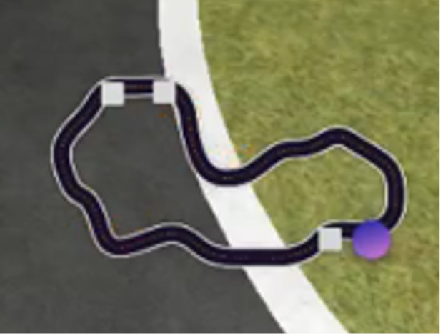
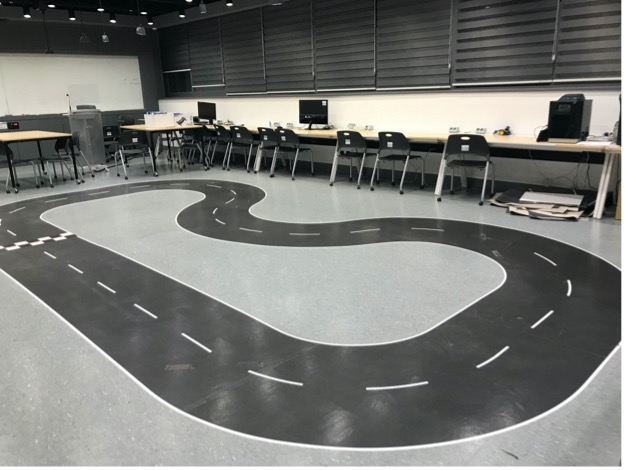
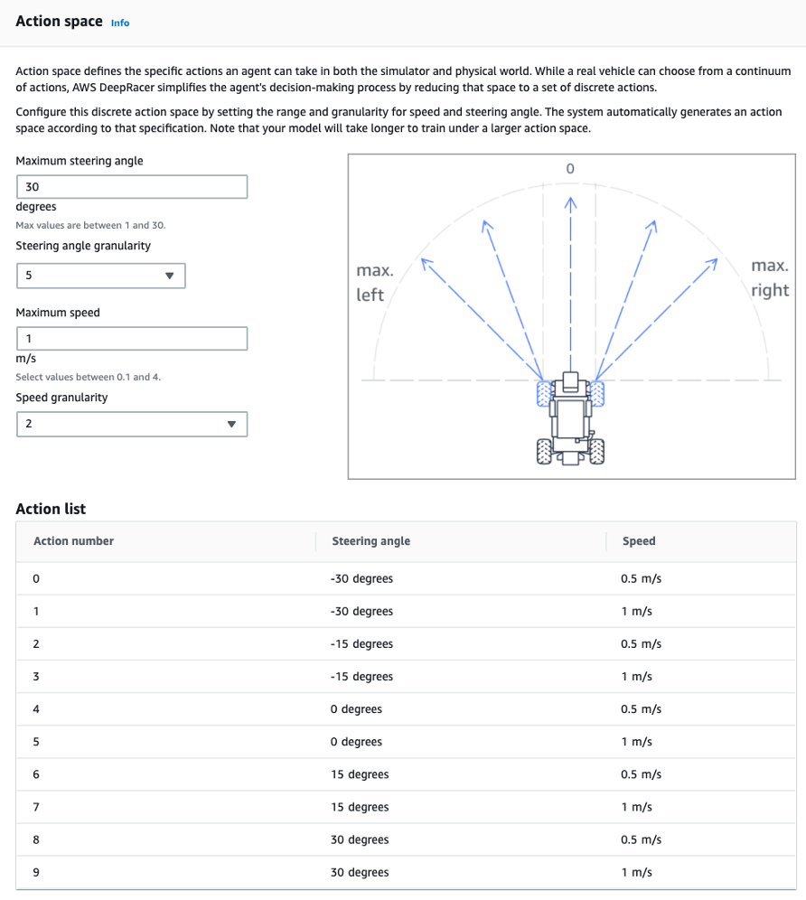
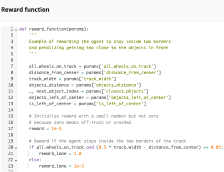
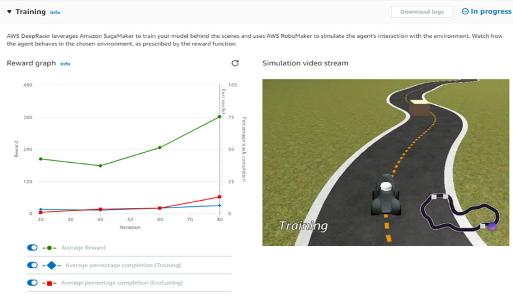
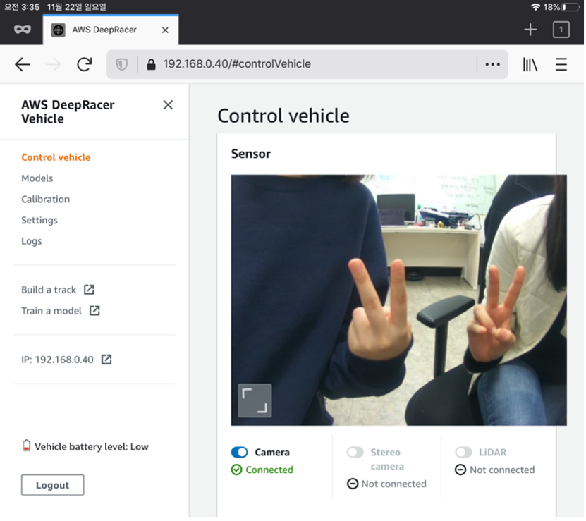

# 4.4. Project3: Self-driving

본 프로젝트의 최종 목적은 훈련한 모델을 사용하여 직선 주로 및 곡선 주로를 성공적으로 주행하는 것이다. 특히 상대적으로 난이도가 있는 곡선 주로를 안정적으로 주행하는 것이 최종 목표이기 때문에 직선과 곡선이 적절하게 혼합된 트랙에서 훈련, 테스트 주행을 진행했다. 시뮬레이션 트랙과 실험을 진행한 물리적 트랙은 **Figure 37.**와 같다.

이전 다른 프로젝트와 달리 기성 하드웨어를 사용하기 때문에 ‘구현’보다도 ‘구동’에 가깝다. 따라서 글을 전개하는 방식에 차이를 두려 한다. 딥레이서의 퍼포먼스는 모델 설계에 따라 차이가 있을 수 있다. 따라서 구동 결과와 과정보다도 모델 설계에 고려할 수 있는 요소들, 성능 향상을 위한 간단한 팁에 대한 소개 위주로 글을 진행하고자 한다. 한국에서 딥레이서를 처음 시작하는 사람들이 더욱 많아지길 염원하며 딥레이서 초심자가 참고할 수 있는 디테일한 한글 가이드를 목표로 글을 진행해보려 한다.

딥레이서가 성공적으로 곡선 주행을 하기까지의 과정을 소개한다. 우선 가장 먼저 AWS DeepRacer의Your garage 메뉴에서 나만의 자동차를 만들어보자! 이 과정에서 **Figure 37\(a\).** 의 Action을 정의할 수 있다. 아래 링크를 통해 딥레이서를 시작해보자!



세부 내용은 다음 AWS의 개발자 가이드를 참고하면 된다.



**Figure 38.**과 같이 학습 과정과 실제 주행에서 선택할 수 있는Action space를 정의한다. 실제 자동차의 주행 상황은 Continuous action이지만 딥레이서에서는 이산화를 거쳐 Discrete Action Space를 설정한다. 조향 각과 속도에 대해 최대값을 정의하고, granularity를 정의하면 각 단계의 곱으로 Action List가 만들어진다. Continuous action의 경우 행동 값의 범위가 무한하기 때문에 Action Space의 크기 또한 무한히 커진다. Action Space의 복잡도가 커지면 학습이 어려워지기 때문에 granularity는 2 또는 3으로 설정하는 것을 추천한다. 딥레이서 앞부분에 장착된 카메라로부터 받아들이는 영상\(State\)에 따라 딥레이서는 이 Action List 중 하나를 수행한다\(Action\). 굳이 어려운 곡선 주로를 주행할 것이 아니라면, 최대 조향각을 작게 가져갈 수록 더 안정되는 경향이 있으니 코스에 따라 20도 정도로 설정하는 것도 좋겠다.

다음으로 Your models 메뉴에서 모델을 설계해보자! 모델 설계에서 가장 중요한 것은 보상 함수 설계 또는 리워드셰이핑\(reward function\)과 하이퍼 파라미터 튜닝\(hyper parameter tuning\)이라 할 수 있겠다.

**Figure 39.** 과 같이 보상 함수는 주피터 노트북에서 직접 수정할 수 있다. Default로 제공되는 보상 함수는 중심선을 따라가며 과도한 조향이나 저속 주행에 패널티를 주는 식으로 설계되어 있다. 시뮬레이터가 제공하는 변수는 자동차 heading, x, y 좌표와 waypoint 정보 등이 있으며\(이에 대해서는 **4.3. DeepRacer**의 링크 주소에 자세히 나와있으니 참고하길 바란다.\) 이를 사용하여 **보상 함수 설계**가가능하다. 보상은 양수로 설정할 수도 있고 음수로 설정할 수도 있다. 양수로 설정하면 상, 음수로 설정하면 벌이 된다. 상만 받거나 벌만 받는 것보다 상벌을 적절히 융합하면 더욱 효과적인 학습이 가능하다. 아래 딥레이서 개발자 가이드에 여러 예시가 소개되어 있으니 참고하기 바란다.



또한 DeepRacer는 기본적으로 PPO알고리즘을 사용하여 학습을 진행한다. \(앞서 언급하였듯 직접 개발한 알고리즘을 사용할 수도 있다.\) 따라서 batch size, epoch, exploration, entropy, discount factor 등 PPO 알고리즘의 **하이퍼 파라미터 튜닝**을 통해서도 학습 성능을 개선시킬 수 있다.

모델 튜닝까지 완료했다면, 본격적으로 학습을 진행할 시간이다! 트랙을 선택할 때는 최종적으로 테스트를 할 트랙과 유사한 트랙을 선택하여 학습을 진행한다. 실제 주행할 트랙을 학습하게 되면 train 상황에 test에 대한 정보가 개입되면서 학습 결과가 오버피팅\(overfitting\)이 될 수 있다. 따라서 모델이 일반화되기 위해서는 동일한 트랙은 지양하는 것이 좋지만, 아예 동떨어진 트랙을 선택하는 것도 좋지 않다. 예를 들어 극단적으로 직선 트랙에서 회전을 고려하지 않고 학습을 했다면 곡선 트랙에서는 회전에 대한 액션을 고려하지 않아 주행에 실패하게 될 것이다.

**Figure 40.** 과 같이 딥레이서 시뮬레이터를 에서 에피소드별 전체 보상 그래프, 시뮬레이터 1인칭 시점 화면을 통해 모델 학습 상태 모니터링이 가능하다. 이제 이 과정을 통해 보상 함수와 하이퍼 파라미터를 바꿔가며 반복적으로 학습 후 최적의 모델을 선택한다. 학습을 완료했다면 이제는 모델을 딥레이서에 탑재하여 실제 구동을 시키는 일만 남았다!

차체와 Wi-fi 통신의 준비가 끝나면 PC 또는 모바일 기기에서 딥레이서의 IP주소를 통해 **Figure 41.** 과 같이 딥레이서 자체 콘솔에 접근할 수 있다. 실제 주행 테스트는 **Figure 37\(b\).**의 트랙에서 진행하였으며, 직선과 곡선 주로가 적절히 섞여있어 주행 테스트에 적합하다고 판단하였다. 시뮬레이션 트랙보다 센터 라인의 간격이 조금 넓다는 차이점에도 불구하고 곡선 주로를 성공적으로 주행하였다. 함께 장착되어 있는 라이다\(Lidar\) 센서도 함께 사용하여 학습한 결과 주변 책상과의 충돌 위기 상황에서 collision avoidance를 잘 수행하는 모습도 확인할 수 있었다.

