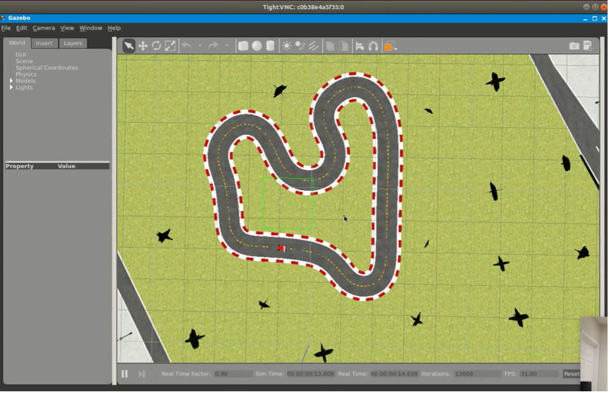
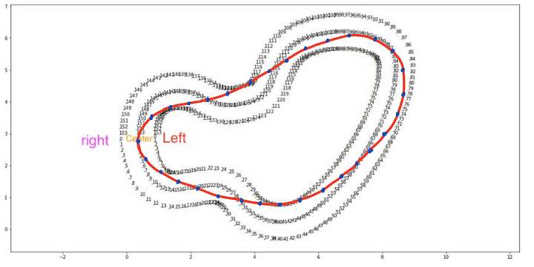
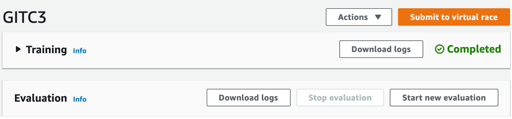

# 4.5. Issues & Future Work

앞서 딥러닝의 “80/20 rule”을 소개한 적이 있다. 이는 비단 딥러닝으로 대표되는 지도학습만의 특징은 아니다. 강화학습에서는 데이터만큼 중요한 것이 바로 시뮬레이터이다. 당연하지만, 실제적인 강화학습 프로젝트의 목적은 단순 강화학습 알고리즘 연구가 아니라 실제 생활 공간에서 잘 작동하는 에이전트를 만드는 것이다. 하지만 자율주행의 경우만 해도 실제 자동차를 수만 번씩 충돌시켜가며 훈련을 하는 것은 무리가 있기 때문에 최적해를 계산하기 위한 튜닝을 신속하고 반복적으로 검증할 수 있는 시뮬레이터가 필요하다. 이 시뮬레이터가 실제 물리적 공간을 잘 반영한다는 것을 입증한 후에야 보상 함수 설계나 하이퍼 파라미터 튜닝 등 성능 개선을 위한 연구와 노력이 의미 있어진다. 따라서 강화학습에서는 시뮬레이션과 실제 물리적 시스템의 관계성에 대해 집중할 필요가 있으며, sim-real gap을 줄이거나 극복하도록 좋은 시뮬레이터를 설계분석하는 것이 딥러닝의 데이터 만큼이나 강화학습에서 중요한 과제라 해도 과언이 아니다.

본 프로젝트에서는 딥레이서에서 배포하는 전용 시뮬레이터를 사용하였다. 이미 수많은 연구개발 끝에 판매가 되는 제품이기도 하고 딥레이서 출시 이후에도 계속해서 개선되고 있기 때문에 시뮬레이터의 신뢰도는 높겠다고 판단하였고, 실제 검증 결과 꽤 유사하게 주행하는 것을 확인하였다. 하지만 유사하다는 것이 주관적 기준일 뿐더러, 따로 시뮬레이터를 변경하는 것은 어렵기 때문에 물리적 시스템에서만 간단한 튜닝을 할 수 밖에 없었다. 또한 조향각과 속도 calibration, 테스트 트랙과 시뮬레이션 트랙의 유사도, 모델의 설계 등에 따라 경우의 수가 많기 때문에 이 부분에 대한 정량적 평가를 내리기 힘든 것은 사실이다. 본 프로젝트에서 테스트 주행을 위해 준비한 **Figure 37\(b\).**의 트랙 같은 경우도 센터라 인의 간격이 **Figure 37\(a\).**보다 훨씬 넓다. 보상 함수를 센터 라인을 벗어나지 않도록 설계 하였으므로 꽤 치명적일 수 있는 sim-real gap인 셈이다. 또한 시트지 재질이기 때문에 마찰력을 비롯한 실제 주행에서 차에 작용하는 역학적 힘 등이 모두 시뮬레이션에 반영될 수 없었을 것이다.

다음으로 추가 프로젝트 수행을 위한 Future Work를 제안한다. 본래 딥레이서의 시뮬레이터는 훈련시킬 수 있는 트랙이 한정되어 있다.

**Figure 42.**와 같이 DeepRacer 전용 시뮬레이터를 사용하지 않고 우분투 기반 로컬 시뮬레이션 환경 구축을 통해 더 다양한 트랙을 활용할 수 있는 방법이 있으니 아래 링크를 참고하기 바란다.



본 프로젝트는 ‘성공적인 구동’을 목표로 하였기 때문에 보상 함수 설계, 하이퍼 파라미터 튜닝 등 모델 설계에 따라 성능 개선의 여지가 남아있다. 특히 보상 함수 설계 과정에서 센터 라인을 따라가는 것 대신, 회전 경로를 최소화하는 방향으로 waypoint를 설정해 주는 방법은 리그에서 거의 필수로 쓰인다. **Figure .** 의 빨간 선이 최소화 된 회전 경로인 레코드 라인\(recode line\)을 나타내며, 파란 점들이 레코드라인을 따라 배치된 이정표의 목록\(blue point\)이다. 기존의 보상함수에서 레코드 라인에 가까이 주행한다면 큰 보상을 주는 방법으로 구현할 수 있다. 자세한 소스 코드에 대해서는 아래 github 링크를 참고하자.



또한 매년 열리는 딥레이서 리그에도 누구나 참여할 수 있으니 강화 학습 기반 자율주행 자동차의 최적 설계를 찾는 목표에 관심이 있다면 리그에 참가해보는 것도 좋은 목표가 되겠다.

마지막으로, **4.6.** **Issues: Sim-real gap**의 연장선에서, sim-real gap에 대해 분석할 수 있는 방법 중 하나를 소개하고 싶다. **Figure .** 와 같이 실제 주행 후 simulation log와 test driving log을 수집할 수 있으므로, 로그 데이터 분석과 시각화를 통해 sim-real gap에 대한 고찰을 데이터적으로 해보는 것도 매우 중요한 과제가 될 것이다.

