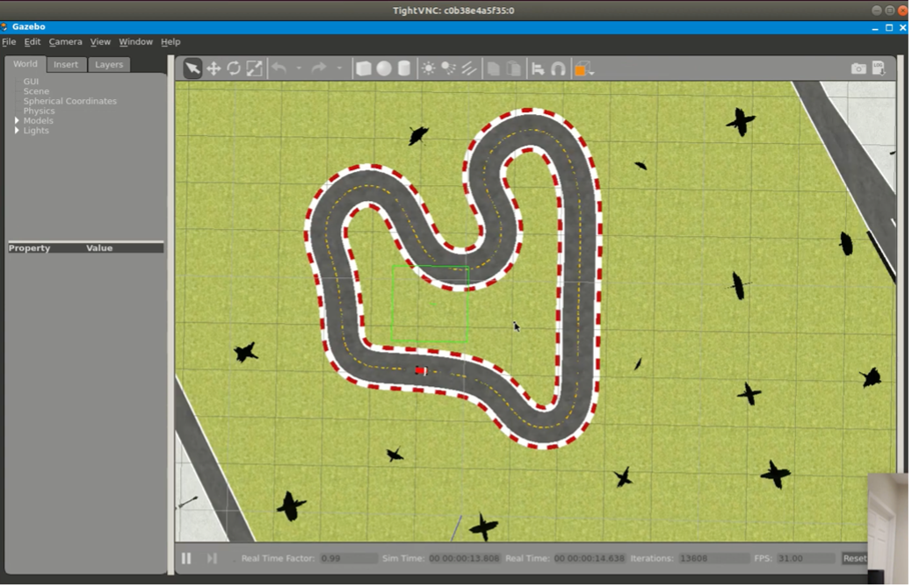
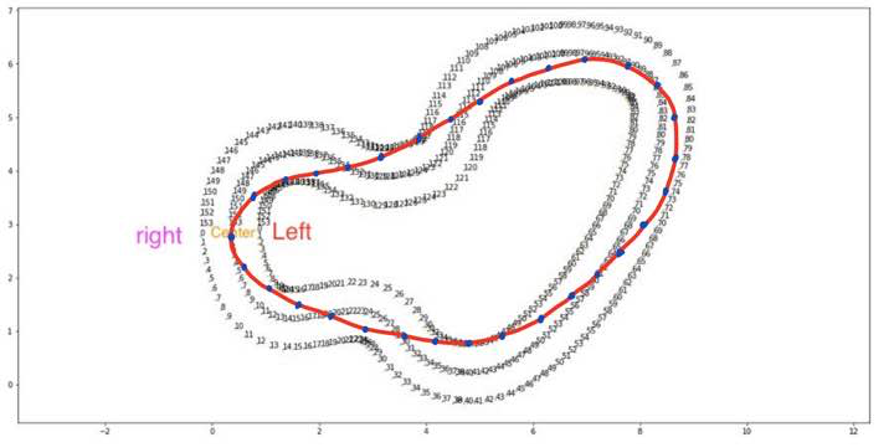
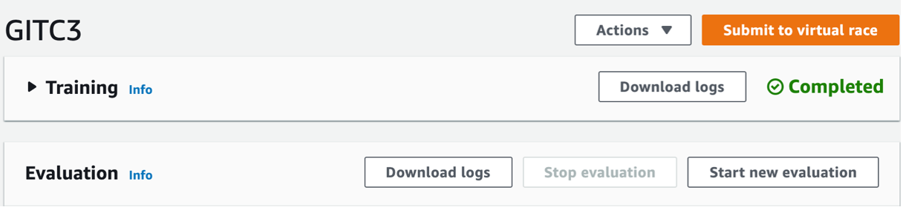

# 4.6. Future Work

다음으로 추가 프로젝트 수행을 위한 Future Work를 제안한다. 본래 딥레이서의 시뮬레이터는 훈련시킬 수 있는 트랙이 한정되어 있다.

**Figure 42.**와 같이 DeepRacer 전용 시뮬레이터를 사용하지 않고 우분투 기반 로컬 시뮬레이션 환경 구축을 통해 더 다양한 트랙을 활용할 수 있는 방법이 있으니 아래 링크를 참고하기 바란다.



본 프로젝트는 ‘성공적인 구동’을 목표로 하였기 때문에 보상 함수 설계, 하이퍼 파라미터 튜닝 등 모델 설계에 따라 성능 개선의 여지가 남아있다. 특히 보상 함수 설계 과정에서 센터 라인을 따라가는 것 대신, 회전 경로를 최소화하는 방향으로 waypoint를 설정해 주는 방법은 리그에서 거의 필수로 쓰인다. **Figure .** 의 빨간 선이 최소화 된 회전 경로인 레코드 라인\(recode line\)을 나타내며, 파란 점들이 레코드라인을 따라 배치된 이정표의 목록\(blue point\)이다. 기존의 보상함수에서 레코드 라인에 가까이 주행한다면 큰 보상을 주는 방법으로 구현할 수 있다. 자세한 소스 코드에 대해서는 아래 github 링크를 참고하자.



또한 매년 열리는 딥레이서 리그에도 누구나 참여할 수 있으니 강화 학습 기반 자율주행 자동차의 최적 설계를 찾는 목표에 관심이 있다면 리그에 참가해보는 것도 좋은 목표가 되겠다.

마지막으로, **4.6.** **Issues: Sim-real gap**의 연장선에서, sim-real gap에 대해 분석할 수 있는 방법 중 하나를 소개하고 싶다. **Figure .** 와 같이 실제 주행 후 simulation log와 test driving log을 수집할 수 있으므로, 로그 데이터 분석과 시각화를 통해 sim-real gap에 대한 고찰을 데이터적으로 해보는 것도 매우 중요한 과제가 될 것이다.

